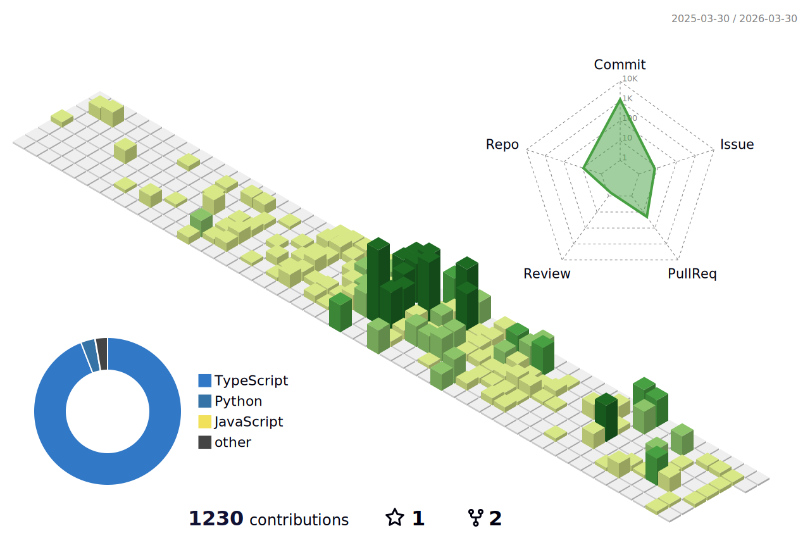

  

<h2 align="center">Hi there 👋, I'm Jeon Ju Seong</h2>

Front-end Developer who loves learning and building delightful user experiences.

---

## 🧑‍💻 About Me

- 🌱 프론트엔드 개발을 꾸준히 공부하고 있습니다.
- 🚀 새로운 도전과 협업, 기술 커뮤니케이션을 즐깁니다.
- 🎯 사용성과 성능을 모두 생각하는 개발자가 목표입니다.

---

## 🛠️ Tech Stack

  
  
  
  
  

---

## 🧩 Collaboration & Tools

  
  
  
  
  
  

---

## 🌟 Featured Projects

- [EduBridge](https://github.com/jeonjuseong11/EduBridge)  
  교육 관련 웹 서비스. React/Next.js 기반의 사용자 친화적 UI/UX 구현.

- [seeya-api](https://github.com/jeonjuseong11/seeya-api)  
  Seeya 서비스의 API 서버. TypeScript 기반 RESTful API, 서비스의 핵심 백엔드 로직 담당.

- [seeya-app](https://github.com/zzangmin2/seeya-app)  
  Seeya 서비스의 프론트엔드(모바일 앱). React Native/Expo 기반, 사용자 경험 중심 개발.

---

## 🚩 My Growth

- 팀 프로젝트 경험을 쌓으며 성장 중입니다.
- 기술 문서화와 코드 리뷰를 통해 더 나은 개발 문화를 추구합니다.
- 새로운 기술 트렌드, 프론트엔드 생태계에 항상 관심을 갖고 있습니다.

---

## 📈 GitHub Stats

  

---

## 📫 Contact

- Email : jeonjuseong11@gmail.com

---

함께 성장하고, 협업하고 싶은 분은 언제든지 연락주세요!  
Thanks for visiting! 🙌
