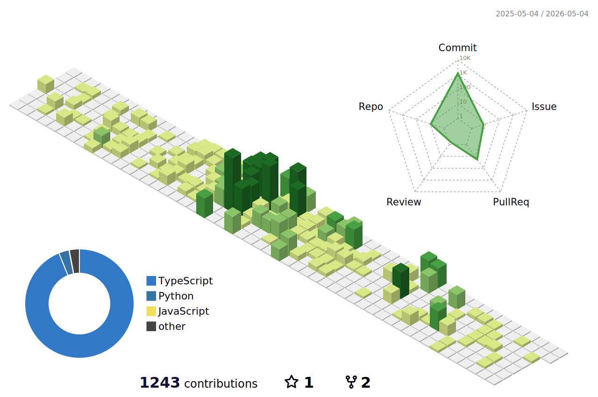

  

<h2 align="center">Hi there 👋, I'm Jeon Ju Seong</h2>

<b>도전과 성장을 즐기는 프론트엔드 개발자</b>

## Tech Stack

  
  
  
  
  
  
  

---

## Collaboration & Tools

  
  
  
  
  
  

## GitHub Stats

  

---

## Contact

- **Email:** jeonjuseong11@gmail.com

---

함께 성장하고 싶은 분, 새로운 협업/제안 언제든 환영합니다!  
Thanks for visiting!
