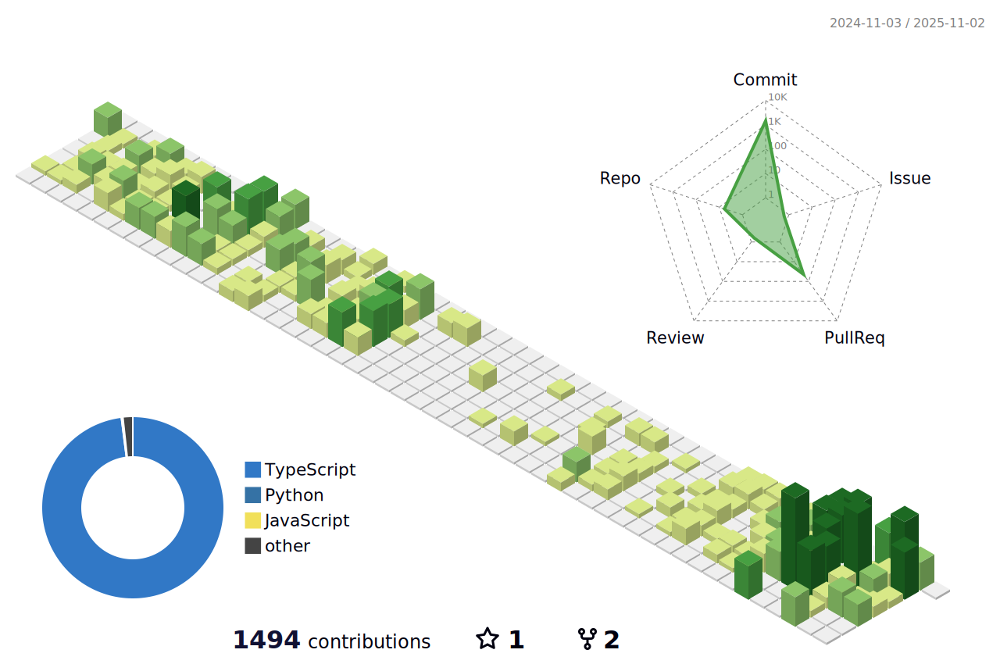

  

안녕하세요! 👋 전주성의 GitHub 프로필에 오신 것을 환영합니다!  
저는 프론트엔드 개발자가 되기위해 노력하고 있으며, 도전적인 문제를 해결하고 새로운 기술을 배우는 것을 즐깁니다.  

## Tech Stack

</a>
</a>
</a>
</a>
</a>

## Collaboration & Tools

#### 코드에디터  
  

#### 협업 및 회의 관리   
   

#### 디자인  
   

#### 형상관리    
   

## Contact Me
### **Email**   
jeonjuseong11@gmail.com  

